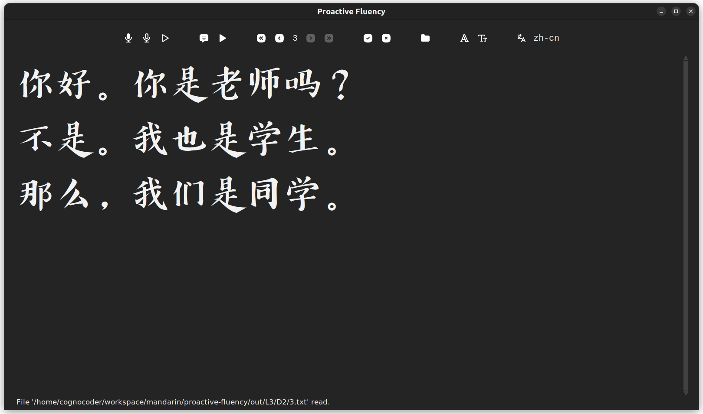

# proactive-fluency

Proactively achieve language fluency.

### Getting Started

- Record and Recognize a Speech to text and Generate a Speech from the inserted Text
- Create a library to study texts and dialogs, quiclky navigate between entries
- Pratice and compare you pronunciation
- Speak, read, listen, and write the language

### Features

|                               Button                               |     | Description                                                     |
| :----------------------------------------------------------------: | --- | :-------------------------------------------------------------- |
|                                                                    |     |                                                                 |
|                     |     | Save `.wav`. Record and Recognize Speech to Text.               |
|             |     | Save `.wav`. Record Speech.                                     |
|            |     | Play the Recorded Speech.                                       |
|                                                                    |     |                                                                 |
|                |     | Save `mp3`. Generate Speech from the inserted Text.             |
|                    |     | Play the Generated Speech.                                      |
|                                                                    |     |                                                                 |
|   |     | Go to first entry.                                              |
|    |     | Go to previous entry.                                           |
|   |     | Go to next entry.                                               |
|  |     | Go to last entry.                                               |
|                                                                    |     |                                                                 |
|           |     | Save `.txt`. Save current entry and go to the next one.         |
|               |     | Delete `.txt`. Delete current entry and go to the privious one. |
|                                                                    |     |                                                                 |
|                         |     | Change current working directory.                               |
|                                                                    |     |                                                                 |
|                     |     | Change the Font Name.                                           |
|                      |     | Change the Font Size.                                           |
|                                                                    |     |                                                                 |
|                       |     | Change the Language.                                            |

### Help, Contributions

You may send an e-mail to [cognocoder@gmail.com](mailto:cognocoder@gmail.com) either to get support or to contribute.
This application was developed using `python3` and `pip`. Fonts are currently required to be installed in the system.

### Roadmap

1. Create bindings
2. User defined bindings, fonts, languages
3. Release executables

### License

This project is licensed under the MIT License. See the [LICENSE](LICENSE) file for details.
